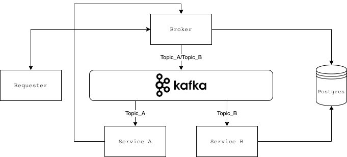

# Microservices

This example is meant to demonstrate the basic concepts of working with microservices with asynchronous events using no
framework.

Services are separated into 4 directories and each of them run separately. You can find out about each one in their
directory!

## Services at a glance!

- [Requester](requester): Initializes the flow by sending a request to [Broker](broker).
- [Broker](broker): An interface between [Requester](requester), [Service A](service_a), Database and, Kafka.
- [Service A](service_a): Kafka consumer.
- [Service B](service_b): Kafka consumer.

## Technologies

* PHP v7.4
* Postgres v10
* Kafka v2
* Docker v3.7

## Requirements

* [Docker](https://www.docker.com/)
* [Docker compose](https://docs.docker.com/compose/)

## Installation

It's as simple as it looks like! You can start all services using docker compose.✨

> Take a note that Kafka consumes a lot of memory, so make sure that you have enough memory available in your docker

```sh
$ docker-compose up -d
```
